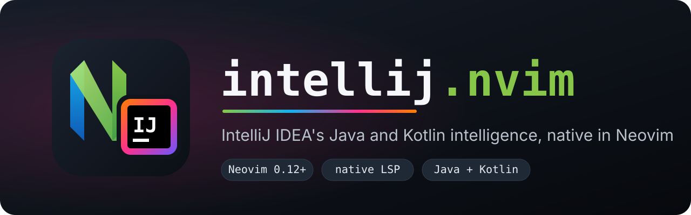

<p align="center">
  
</p>

<p align="center">
  <a href="https://neovim.io"></a>
  
  
  <a href="LICENSE"></a>
</p>

<p align="center">
  <b>The engine behind IntelliJ IDEA's Java and Kotlin support, running in Neovim through the built-in LSP client.</b>
</p>

<p align="center">
  <a href="#installation">Installation</a> &bull;
  <a href="#quick-start">Quick start</a> &bull;
  <a href="#configuration">Configuration</a> &bull;
  <a href="#completion">Completion</a> &bull;
  <a href="#commands">Commands</a> &bull;
  <a href="#troubleshooting">Troubleshooting</a>
</p>

---

intellij.nvim runs JetBrains' IntelliJ Language Server, the "Java & Kotlin by IntelliJ IDEA" preview published as the VS Code extension `JetBrains.intellij-server`, inside Neovim >= 0.12 using the native `vim.lsp.config` / `vim.lsp.enable` API. It downloads and verifies the server, handles EULA acceptance, starts one server per project root, opens JDK and library sources, and reports project import progress. See the [announcement](https://blog.jetbrains.com/idea/2026/08/intellij-idea-goes-lsp/) for background on the server.

## Why intellij.nvim

- **IDE-grade analysis.** The same inspections, quick fixes and refactorings that power IntelliJ IDEA, including data-flow warnings such as "value of parameter is always ...".
- **Native Neovim.** Built on `vim.lsp.config`, `vim.lsp.enable` and `lsp/intellij.lua`. No nvim-lspconfig, no wrapper UI, no custom keymaps.
- **Opt-in filetypes.** Attaches to `java` by default and only to the filetypes you list; Kotlin is one entry away.
- **One command setup.** `:IntelliJ install` fetches the right build for your platform, verifies its sha256 and walks you through the EULA.
- **Real project import.** Maven, Gradle and Bazel projects are imported by the server, with progress and per-folder failure reports.
- **Library navigation.** Go to definition lands in JDK and dependency sources, opened as read-only `jar:` / `jrt:` buffers that stay attached to the server.

## Features

| Capability | How to use it in Neovim |
| --- | --- |
| Completion | `vim.lsp.completion` with autotrigger, blink.cmp or nvim-cmp (see [Completion](#completion)) |
| Signature help | `<C-s>` in Insert mode, also triggered after accepting a method completion |
| Hover documentation | `K` |
| Go to definition, including library sources | `<C-]>` or `vim.lsp.buf.definition()` |
| References, implementations, type definition | `grr`, `gri`, `grt` |
| Rename | `grn` |
| Code actions and quick fixes | `gra` |
| Formatting | `vim.lsp.buf.format()` |
| Diagnostics | `vim.diagnostic`, pulled and published by the server |
| Inlay hints | `vim.lsp.inlay_hint.enable()` |
| Semantic tokens | enabled automatically |
| Call and type hierarchy | `vim.lsp.buf.incoming_calls()`, `vim.lsp.buf.typehierarchy('subtypes')` |
| Document symbols | `gO` |
| Project import | automatic, with progress messages; `:IntelliJ reload` to reimport |

All keymaps above are Neovim core defaults (`:help lsp-defaults`); this plugin defines none.

## Requirements

- Neovim >= 0.12
- `curl`, `unzip`, `tar` and `sha256sum` or `shasum` on `PATH` (used by `:IntelliJ install`)
- About 376 MB of download and disk space for the server
- A JDK for your project (`java_home`, defaults to `$JAVA_HOME`)
- A supported build tool: Maven (`mvn` on `PATH` or a Maven wrapper), Gradle (on `PATH` or a Gradle wrapper) or Bazel
- macOS, Linux or Windows on x64 or arm64

A locally installed IntelliJ IDEA cannot be reused: the language server is a separate product and is always downloaded by `:IntelliJ install`.

## Installation

[lazy.nvim](https://github.com/folke/lazy.nvim):

```lua
{
  'yashLadha/intellij-neovim',
  main = 'intellij',
  opts = {
    filetypes = { 'java' },
  },
}
```

`main = 'intellij'` is required because lazy.nvim cannot infer the module name from the repository name.

Built-in [`vim.pack`](https://neovim.io/doc/user/pack.html):

```lua
vim.pack.add({ 'https://github.com/yashLadha/intellij-neovim' })
require('intellij').setup({ filetypes = { 'java' } })
```

## Quick start

1. Run `:IntelliJ install`. The latest server for your platform is downloaded, checksum verified and unpacked. Progress is shown in the message area.
2. Accept the EULA. After a fresh install the EULA opens automatically in a new tab with an Accept / Decline prompt. Run `:IntelliJ eula` to show it again.
3. Open a Java file inside a Maven, Gradle or Bazel project. The server starts, imports the project and reports progress ("importing workspace", then "workspace imported" or "workspace import failed").

## Configuration

`require('intellij').setup(opts)` accepts:

| Option | Type | Default | Description |
| --- | --- | --- | --- |
| `filetypes` | `string[]` | `{ 'java' }` | Filetypes the server attaches to. Replaces the default list. |
| `server_dir` | `string?` | `nil` | Path to an unpacked server directory. Overrides any installed server. |
| `data_dir` | `string` | `stdpath('data') .. '/intellij'` | Where servers (`servers/<version>`) and the accepted EULA hash (`eula`) are stored. |
| `java_home` | `string?` | `$JAVA_HOME` | JDK sent to the server as `defaultSdk` for project import. |
| `jvm_options` | `string[]` | `{}` | JVM options for the server, appended to `IJ_JAVA_OPTIONS`. |

`setup()` validates the options, sets `filetypes` on the `intellij` LSP config and calls `vim.lsp.enable('intellij')`.

Enable Java and Kotlin:

```lua
require('intellij').setup({
  filetypes = { 'java', 'kotlin' },
  jvm_options = { '-Xmx4g' },
})
```

### Native configuration without `setup()`

The plugin ships `lsp/intellij.lua`, so the server can be configured with the core API alone. Options are then read from the `vim.g.intellij` table:

```lua
vim.g.intellij = {
  filetypes = { 'java', 'kotlin' },
  java_home = '/path/to/jdk',
  jvm_options = { '-Xmx4g' },
}
vim.lsp.enable('intellij')
```

`vim.lsp.config('intellij', { filetypes = { ... } })` also works and takes precedence. `vim.g.intellij` is ignored once `setup()` has been called.

### Other LSP settings

Any other `vim.lsp.Config` field (`settings`, `init_options`, `on_attach`, `capabilities`, ...) goes through `vim.lsp.config('intellij', { ... })`, with or without `setup()`:

```lua
vim.lsp.config('intellij', {
  capabilities = require('blink.cmp').get_lsp_capabilities(),
})
```

`init_options` are deep-merged over the plugin's `{ intellijExtensions = true, defaultSdk = <java_home> }`. The server drops the whole object if any field is invalid, so add fields with care.

Project roots are detected in this order: the nearest `settings.gradle`, `settings.gradle.kts`, `MODULE.bazel`, `WORKSPACE` or `WORKSPACE.bazel`; then the outermost directory of a chain of nested `pom.xml` files; then the nearest `pom.xml`, `build.gradle`, `build.gradle.kts`, `BUILD.bazel` or `.git`. Files outside any root are not attached.

## Completion

Use Neovim's built-in completion from an `LspAttach` autocmd:

```lua
vim.api.nvim_create_autocmd('LspAttach', {
  callback = function(ev)
    local client = assert(vim.lsp.get_client_by_id(ev.data.client_id))
    if client.name == 'intellij' and client:supports_method('textDocument/completion') then
      vim.lsp.completion.enable(true, client.id, ev.buf, { autotrigger = true })
    end
  end,
})
```

[blink.cmp](https://github.com/Saghen/blink.cmp) and [nvim-cmp](https://github.com/hrsh7th/nvim-cmp) also work; pass their capabilities through `vim.lsp.config('intellij', { capabilities = ... })` as shown above.

## Commands

| Command | Description |
| --- | --- |
| `:IntelliJ install` | Download the latest server into `<data_dir>/servers/<version>`, verify its sha256 and prompt for the EULA if needed. Does nothing if that version is already installed. |
| `:IntelliJ eula` | Show the EULA of the current server and accept or decline it. |
| `:IntelliJ reload` | Ask the server attached to the current buffer to reimport the workspace (`intellij/reloadWorkspace`). |
| `:IntelliJ log` | Open the server log of the current buffer's client in a new tab, or the Neovim LSP log if there is none. |

## Health

Run `:checkhealth intellij` to check the Neovim version, configuration, the tools `:IntelliJ install` needs, installed server and executable, EULA status, `java_home`, `mvn` / `gradle` availability, whether the `intellij` config is enabled and whether `jdtls` or `kotlin_lsp` are enabled for the same filetypes.

## Troubleshooting

- **Server does not start: "server not installed" or "EULA not accepted".** Run `:IntelliJ install` or `:IntelliJ eula`. The acceptance is tied to the hash of the EULA text, so a new server version with a changed EULA must be accepted again.
- **Workspace import failed.** The notification lists each failed folder with its build tool and message. Check that `mvn` is on `PATH` or the project has a Maven or Gradle wrapper, and that `java_home` (or `$JAVA_HOME`) points to a JDK. Fix the problem and run `:IntelliJ reload`.
- **"this server build has expired" (exit code 7).** Preview builds expire about 30 days after release. Run `:IntelliJ install` to get the latest build and accept its EULA. Older versions under `<data_dir>/servers` can be deleted.
- **Conflicts with other Java servers.** Disable nvim-jdtls and lspconfig's `jdtls` and `kotlin_lsp` for the same filetypes, for example `vim.lsp.enable('jdtls', false)`.
- **Logs.** `:IntelliJ log` opens `<system-path>/system/log/intellij-server.log`. The system path, which also holds the index, is `stdpath('cache')/intellij/<hash>` where `<hash>` is the first 12 characters of the sha256 of the project root. Deleting it forces a full reindex. Import log messages are written to the Neovim LSP log (`:lua vim.cmd.tabnew(vim.lsp.log.get_filename())`).
- **Out of memory or slow on large projects.** Increase the heap with `jvm_options = { '-Xmx4g' }`.

## Development

Run `make test` for the headless test suite and `make lint` for the stylua check.

## Licensing

The IntelliJ Language Server is proprietary JetBrains software distributed under its own EULA, which you accept through `:IntelliJ eula`. The preview is free to use, but each build expires after about 30 days. After the preview period the server requires an IntelliJ IDEA Ultimate subscription. This plugin does not bundle or redistribute the server.

intellij.nvim is a community project and is not affiliated with or endorsed by JetBrains. IntelliJ IDEA is a trademark of JetBrains s.r.o.

## License

This plugin is released under the MIT License. See [LICENSE](LICENSE).
